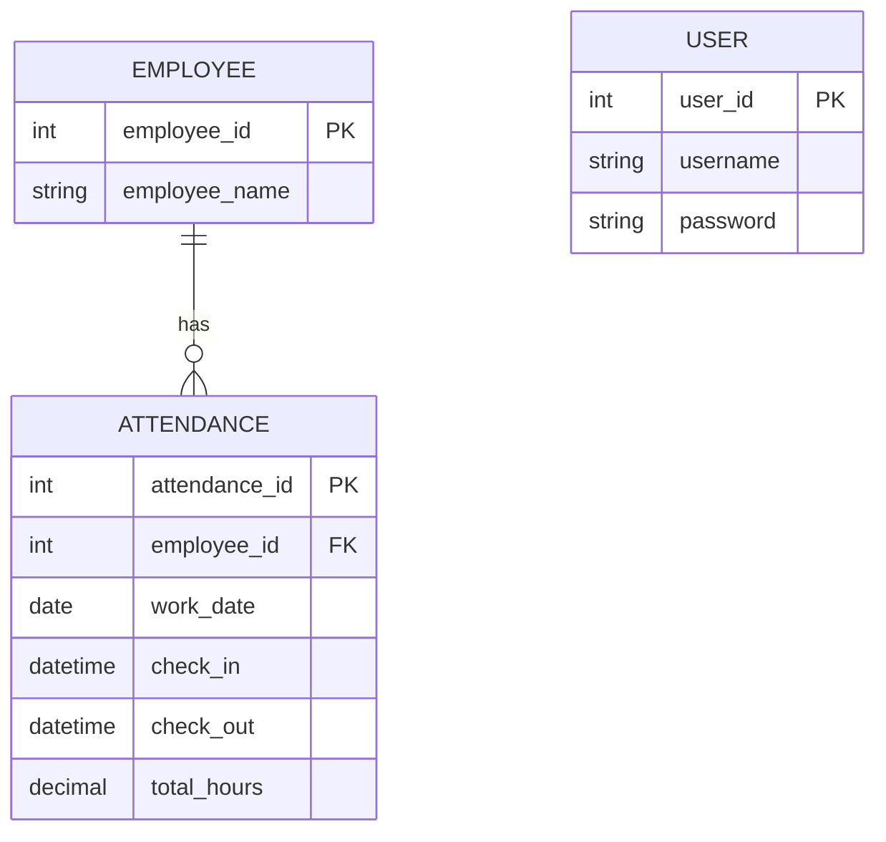

# Solution Attendance Dashboard - Documentation

This is a web application used to view employee attendance with 
data from the solution fingerprint as the source. Tech used in this project includes:
- Typescript
- Node.JS
- PostgreSQL
- Prisma
- Tailwind CSS

## Features
- Database of employee data
- View for employee attendance data
- Summary report of employee attendance data

## Entity Relationship Diagram
